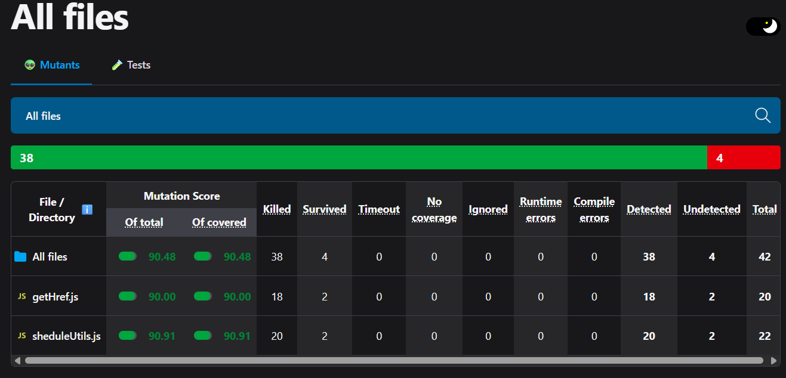
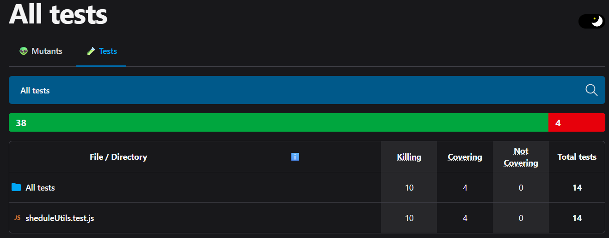

# Test Coverage Report

## Coverage Summary

- Statements: 30.29%
- Branches: 9.85%
- Functions: 8.74%
- Lines: 32.22%

## Analysis

- Best covered functions: `getHref` and `filterClassesArray`, because the test set exercises empty inputs, null/undefined values, protocol normalization, duplicate removal, and unique-array behavior.
- Needs more tests: `getScheduleByType` is still a candidate for future coverage if the assignment expands beyond the current helper targets.
- Branches that may be skipped: defensive early returns for empty or missing link values, as well as duplicate-filtering branches that only execute when repeated IDs are present.
- Killed mutants summary: the new tests are intended to kill mutants around null checks, `https://` prefixing, attribute passthrough, and duplicate-ID filtering. Replace this note with the final Stryker result after running mutation testing.

## Notes

- Fill in the final coverage numbers from the latest Jest coverage run if they differ from the target placeholders above.
- Add any surviving mutant IDs and the follow-up test cases needed to kill them.

